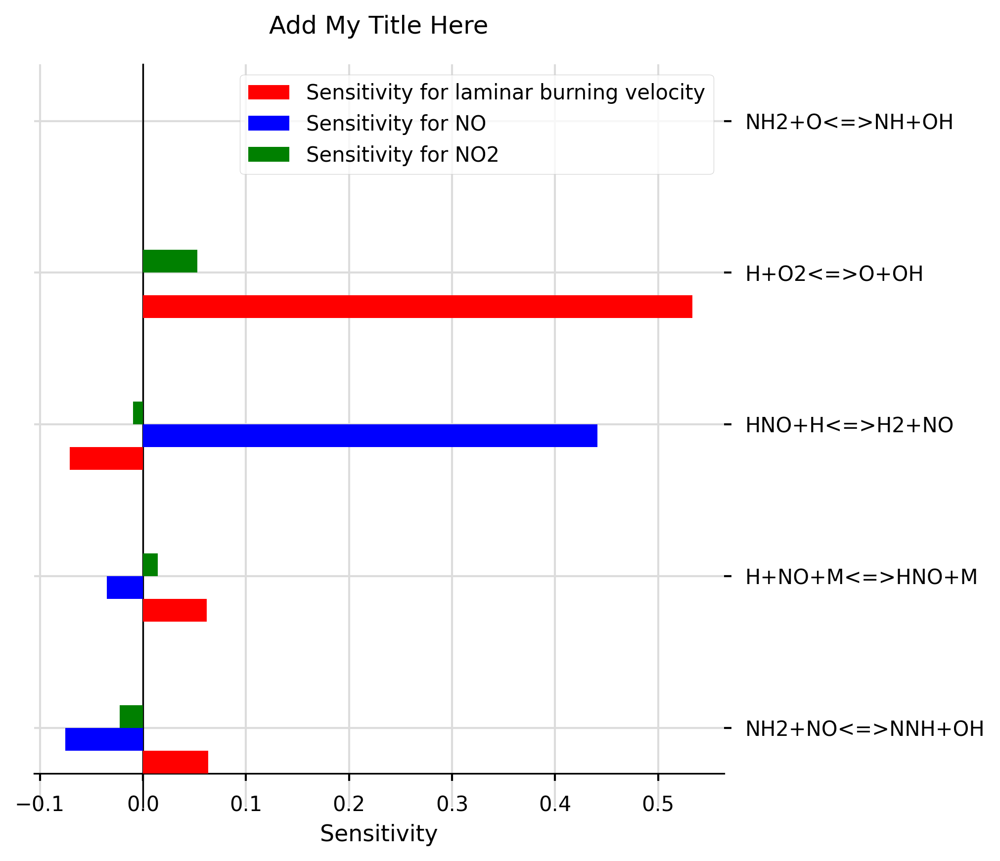

# chemkin-sensitivity-analysis

## To Install on macOS:
1. Go to [macOS installation file](https://github.com/marina8888/chemkin-sensitivity-analysis/blob/master/src/install_files/macos_install.sh), click on the Raw button and right click Save As to save the installation script. Please save it in the directory where you want this project to be saved (e.g the Developer folder)
2. Go to terminal and type `cd path/to/where/your/installation/script/is/saved` to go to the directory with the installation script
3. Once in this directory, type `./install_mac.sh` to install the project and its dependencies 
4. Once the installation in complete, enter the folder by typing: `cd command-line-chemkin`
5. Activate your python environment by typing: `cd source bin/activate`
6. You can now launch the project from your text editor of choice (pycharm, Atom, Sublime text etc.) src is the root directory.
7. Please type any instruction commands in src/main.py. Please see the sample code section for more details.

## To Install on Windows:
Coming soon...


## src/spreadsheet/create_graphs.py file:
Uses matplotlib library to plot sensitivity data as bar charts. Sensitivity data must be saved in .csv file using the format CHEMKIN postprocessing tool uses to save data to spreadsheet.


### Sample code: 
To generate graphs your chemkin spreadsheets should be uploaded to a new folder in the src folder. To plot, a graph object must be created in src/main.py, where graph_object.plot_bar_ functions can be used to plot the sensitivities as follows:
```
from spreadsheet import create_graphs

def main():
    # Create a new graph:
    marina = create_graphs.Graph('Add My Title Here')

    #Add laminar burning velocity plot using CHEMKIN generated export.csv spreadsheet:
    marina.plot_bar_lam_burning_v('okafor_lam_sens/export.csv', ['NH2+O<=>NH+OH', 'NH2+NO<=>NNH+OH','H+NO+M<=>HNO+M', 'HNO+H<=>H2+NO', 'H+O2<=>O+OH'])

    #Add species plots for NO and NO2, with an offset create grouped bars:
    marina.plot_bar_species('./okafor_sens/Okafor_0.85_0.4sens.csv', 'NO', ['NH2+O<=>NH+OH', 'NH2+NO<=>NNH+OH','H+NO+M<=>HNO+M', 'HNO+H<=>H2+NO', 'H+O2<=>O+OH'], offset=0.15)
    marina.plot_bar_species('./okafor_sens/Okafor_0.85_0.4sens.csv', 'NO2', ['NH2+O<=>NH+OH', 'NH2+NO<=>NNH+OH','H+NO+M<=>HNO+M', 'HNO+H<=>H2+NO', 'H+O2<=>O+OH'], colour = 'g', offset=0.3)
    
    #Save graphs to ./output/graphs folder (which user may need to create) under the name test.png:
    marina.show_and_save('./output/graphs', 'test')

if __name__ == "__main__":
    main()
```

### Example graph (generated from sample code above):



Please note that the __distance X at which you need the sensitivities to be taken at should be included in the function arguments,__ and will be in the same units as the spreadsheet, as per description for plotting species sensitivities: 

```
    def plot_bar_species(self, name_of_folder_n_sheet: str, gas_to_add: str, list_of_eq: list = None, multiplier: float = 1,
                         colour: str = 'b', X: float = 0.02, offset: float = 0):
        """
        This function takes REACTION SENSITIVITY values from a spreadsheet at default distance X(cm) = 2.0 and plots them.
        The  user can modify this distance to better describe the point at which gases were samples,
        (which is usually the end point of the combustor).
        """
```
A multiplier is available to scale up all values. If equations are not specified here, all equations pertinent the species of interest will be plotted. 


Assumes the use of laminar flame calculator module for calculating the laminar burning velocity sensitivity, which uses similar argument list: 
```
    def plot_bar_lam_burning_v(self, name_of_folder_n_sheet: str, list_of_eq=None, multiplier: float = 1,
                               colour: str = 'red', X: float = 0, offset: float = 0):
        '''
        this function takes LAMINAR BURNING VELOCITY SENSITIVITY and plots it on a bar chart at default distance = 0 cm.
        The  user can modify this distance to better describe where the unburnt mixture flowrate should be taken.
        '''
```

## src/spreadsheet/convert_rop_col.py file:
WARNING - THIS SCRIPT IS HERE FOR REFERENCE ONLY. PLEASE PRE-PROCESS CHEMKIN CHEMISTRY IN THE GUI GENERATE WELL-FORMATED COLUMN HEADERS INSTEAD OF USING THIS SCRIPT. 

This script finds csv file column headers named in the format: `<GAS>_ROP_GasRxn#<number> (mole/cm3-sec)`, where <GAS> is the sensitivity of a considered gas, ROP stands for rate of production, and <number> is a reaction number from a mechanism. 
  It proceeds to rename the column headers with the relevant equations from the mechanisms, e.g: 
  ` CH4_ROP_H+HCO(+M)<=>CH2O(+M)`
    
## Contributions
To contribute please raise an issue then open a pull request for review. 
