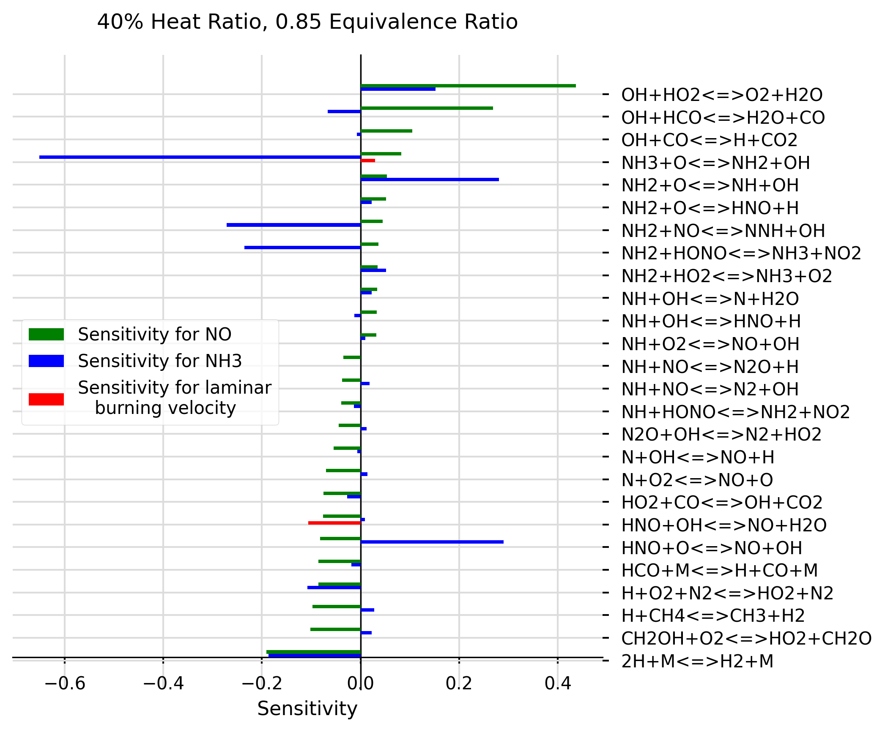

# chemkin-sensitivity-analysis

[](https://app.codacy.com/manual/marina8888/chemkin-sensitivity-analysis?utm_source=github.com&utm_medium=referral&utm_content=marina8888/chemkin-sensitivity-analysis&utm_campaign=Badge_Grade_Dashboard)

## To Install Directory on macOS (New Users)
1.Go to [macOS installation file](https://github.com/marina8888/chemkin-sensitivity-analysis/blob/master/install_files/macos_install.sh), click on the Raw button and right click Save As to save the installation script. Please save it in the directory where you want this project to be saved (e.g the Developer folder)

2.Go to terminal and type `cd path/to/where/your/installation/script/is/saved` to go to the directory with the installation script

3.Once in this directory, type `./install_mac.sh` to install the project and its dependencies 

4.Once the installation in complete, enter the folder by typing: `cd command-line-chemkin`

5.Activate your python environment by typing: `cd source bin/activate`

6.You can now launch the project from your text editor of choice (pycharm, Atom, Sublime text etc.) src is the root directory.

7.Please type any instruction commands in src/main.py. Please see the sample code section for more details.

## To Install Directory on Windows (New Users)
Coming soon...

## Experienced Users

Setup your platform for development in Python3 and clone repo from the [GitHub repo](https://github.com/marina8888/chemkin-sensitivity-analysis). Install requirements.txt file for the required libraries. 

## Creating Sensitivity Graphs
all code in __src/spreadsheet/create_graphs.py file__ and __src/spreadsheet/prepare_sheet.py file__.
Uses matplotlib library to plot sensitivity data as bar charts. Sensitivity data must be saved in .csv file using the format CHEMKIN postprocessing tool uses to save data to spreadsheet.

### Sample code
To generate graphs your chemkin spreadsheets should be uploaded to a new folder in the src folder. To plot, a graph object must be created in src/main.py, where graph_object.plot_bar_ functions can be used to plot the sensitivities as follows:
```
from spreadsheet import create_graphs

def main():
    df = prepare_sheet.add_distance('data/okafor_stag_sens/okafor_stag_0.85_0.4.csv', 0.02)
    df_lam = prepare_sheet.add_distance('data/okafor_lam_sens/okafor_lam_0.85_0.4.csv', 0.02)

    graph = create_graphs.Graph('40% Heat Ratio, 0.85 Equivalence Ratio')


    NO_equations = graph.plot_bar_species(df, 'NO', X = 0.02, colour = 'g', filter_above=0.03, filter_below=-0.03, offset = 0.15, sorting = True)

    graph.plot_bar_species(df, 'NH3', list_of_eq = NO_equations, X = 0.02, multiplier=0.5)
    graph.plot_bar_lam_burning_v(df_lam, list_of_eq = NO_equations, X = 0,  offset = -0.15)

    graph.show_and_save('./output/graphs', 'me')

if __name__ == "__main__":
    main()
```

### Example graph (generated from sample code above)



### Basic Usage

__Create a new graph object and give it a random name:__

```
random_name = create_graphs.Graph('My Graph', 'x label')
```
With details as below: 

```
class Graph():
    def __init__(self, title: str, x_axis_label: str = 'Sensitivity', x_graph_size: int = 6,
                 y_graph_size: int = 6.5):
        """
        
        Parameters
        ----------
        title : is the title of the graph
        x_axis_label : x label
        x_graph_size : width of graph with default value
        y_graph_size : height of graph with default value
        """
```

__Then to create a new bar plot (or multiple plots on one graph), call one of the following two functions on your newly created graph object:__

SPECIES PLOT: 
```buildoutcfg
    def plot_bar_species(self, name_of_folder_n_sheet: str, gas_to_add: str, list_of_eq: list = None, multiplier: float = 1, filter_above = None, filter_below= None,
                         colour: str = 'b', X: float = 0.02, offset: float = 0):
        """
        This function takes REACTION SENSITIVITY values from a spreadsheet at default distance X = 0.02 and plots them.
        The  user can modify this distance to better describe the point at which gases were samples,
        (which is usually the end point of the combustor).
        Parameters
        ----------
        name_of_folder_n_sheet : path to file
        gas_to_add : select a gas of interest
        list_of_eq : optional list of equations to plot (if not included, will find all equations in file)
        multiplier : multiply all values by this constant
        filter_above : plot only the data above this value
        filter_below : plot only the data below this value 
        colour : colour of bars
        X : X value frmo spreadsheet at which sensitivity should be measured
        offset : offset for bars in order to create a grouped plot. This should increase in increments of bar width (currently at 0.15)

        Returns None
        -------

        """
```

LAMINAR PLOT: 

```
def plot_bar_lam_burning_v(self, name_of_folder_n_sheet: str, list_of_eq=None, multiplier: float = 1, filter_above = None, filter_below= None,
                               colour: str = 'red', X: float = 0, offset: float = 0):
        """
        PLOT LAMINAR BURNING VELOCITY at distance X (default 0). Assume using Flowrate_sens columns frmo CHEMKIN spreadsheet.
        Parameters
        ----------
        name_of_folder_n_sheet : path to file
        list_of_eq : if added, will only plot these chemical equations (otherwise will plot all equations available in spreadsheet).
        multiplier : multiply all sensitivity values by this constant
        filter_above : take all values above this one
        filter_below : take all values below this one
        colour : bar colour
        X : X distance
        offset : for bar graph spacing

        Returns None
        -------

        """
```
__Save all values__:

```
    def show_and_save(self, path_of_save_folder: str, name: str):
        """

        Parameters
        ----------
        path_of_save_folder : where to save
        name : name under which picture should be saved

        Returns None
        -------

```

## Numbering Equations From GasRxn Numbers
WARNING - THIS SCRIPT IS HERE FOR REFERENCE ONLY. PLEASE PRE-PROCESS CHEMKIN CHEMISTRY IN THE GUI GENERATE WELL-FORMATED COLUMN HEADERS INSTEAD OF USING THIS SCRIPT. 
All code in __src/spreadsheet/convert_rop_col.py file__.
This script finds csv file column headers named in the format: `<GAS>_ROP_GasRxn#<number> (mole/cm3-sec)`, where <GAS> is the sensitivity of a considered gas, ROP stands for rate of production, and <number> is a reaction number from a mechanism. 
  It proceeds to rename the column headers with the relevant equations from the mechanisms, e.g: 
  ` CH4_ROP_H+HCO(+M)<=>CH2O(+M)`
    
## Contributions
To contribute please raise an issue then open a pull request for review. 
