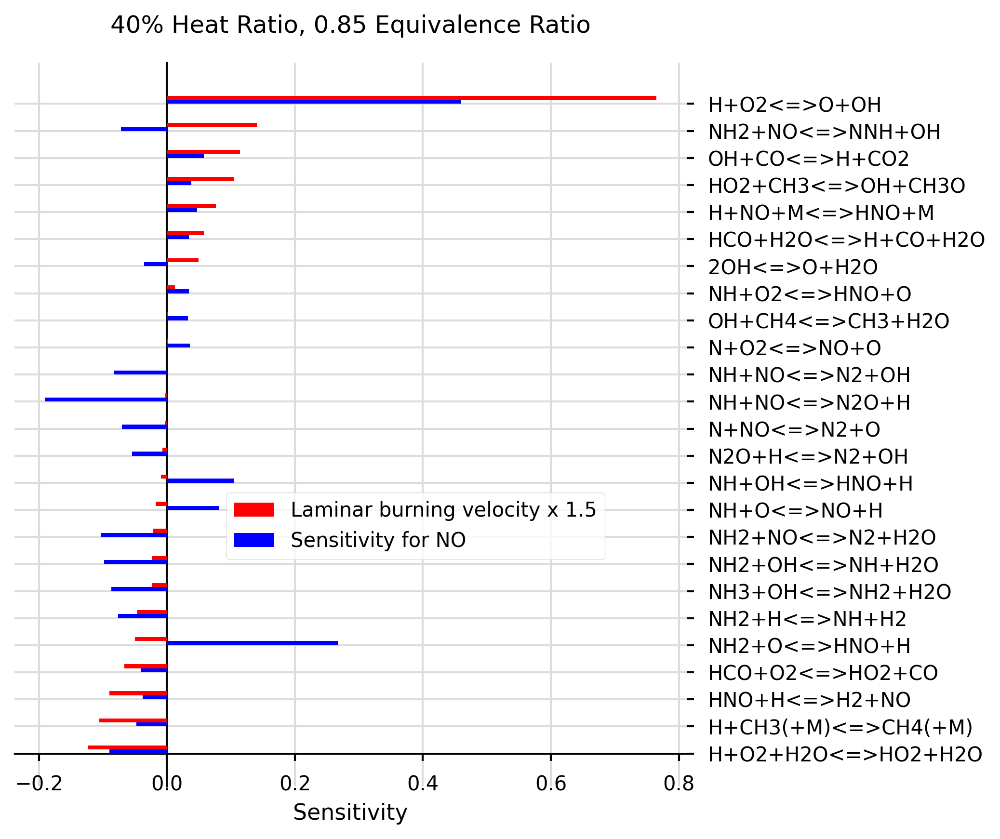

# chemkin-sensitivity-analysis

[](https://app.codacy.com/manual/marina8888/chemkin-sensitivity-analysis?utm_source=github.com&utm_medium=referral&utm_content=marina8888/chemkin-sensitivity-analysis&utm_campaign=Badge_Grade_Dashboard)

## Example graph (use sample code below as test)




## To Install Directory on macOS (New Users)
1.Go to [macOS installation file](https://github.com/marina8888/chemkin-sensitivity-analysis/blob/master/install_files/macos_install.sh), click on the Raw button and right click Save As to save the installation script. Please save it in the directory where you want this project to be saved (e.g the Developer folder)

2.Go to terminal and type `cd path/to/where/your/installation/script/is/saved` to go to the directory with the installation script

3.Once in this directory, type `./install_mac.sh` to install the project and its dependencies 

4.Once the installation in complete, enter the folder by typing: `cd command-line-chemkin`

5.Activate your python environment by typing: `cd source bin/activate`

6.You can now launch the project from your text editor of choice (pycharm, Atom, Sublime text etc.) src is the root directory.

7.Please type any instruction commands in src/main.py. Please see the sample code section for more details.

## To Install Directory on Windows (New Users)

1.Install Python3 using the web-based installer from Windows 64 or 32x86 web-based installer: [install python](https://www.python.org/downloads/release/python-383/). During the installation process tick "Add Python 3.x to PATH " and press "Install Now".

2.Configure python to your path (if it is not already configured): 
[path configuration guide](https://projects.raspberrypi.org/en/projects/using-pip-on-windows/4)

3.In your cmd, get python to install pip by typing: `python -m pip install -U pip`, and then upgrade to the latest version of pip by typing  `python -m pip install –upgrade pip`. Your computer is now configured for python programming. 

4.Install a python friendly text editor, for example PyCharm (community) is recommended: [download PyCharm](https://www.jetbrains.com/pycharm/download/#section=mac)

5.To work with the GitHub command line download Git Bash: [download Git Bash](https://gitforwindows.org/)

6.If required, make a folder where you want to store the project. Open the just installed Git BASH and type `cd path/to/folder` then type `git clone https://github.com/marina8888/chemkin-sensitivity-analysis.git` to clone the repo to your computer. 

7.Use your text editor to set up and environment, configuration and libraries from requirements.txt folder are installed. Find the install the required packages heading: 
[PyCharm initial configuration](https://www.jetbrains.com/help/pycharm/creating-and-running-your-first-python-project.html) and [install the required packages](https://www.jetbrains.com/help/pycharm/managing-dependencies.html)

8.Select 'Mark directory as Sources Root' on the src folder: [Mark directory as sources root](https://www.jetbrains.com/help/pycharm/configuring-folders-within-a-content-root.html#unmark)

9.Modify the src/main.py file as per the sample code and press run. 

## Experienced Users

Setup your platform for development in Python3 and clone repo from the [GitHub repo](https://github.com/marina8888/chemkin-sensitivity-analysis). Install requirements.txt file for the required libraries. 

## Creating Sensitivity Graphs
all code in __src/spreadsheet/create_graphs.py file__ and __src/spreadsheet/prepare_sheet.py file__.
Uses matplotlib library to plot sensitivity data as bar charts. Sensitivity data must be saved in .csv file using the format CHEMKIN postprocessing tool uses to save data to spreadsheet.
Preferred method of extracting files from CHEMKIN is with the export utility option:
 

Once the files have been extracted with export utility, they can be joined using `df = prepare_sheet.join_files('path/to/folder')`
and then the spaces can be removed using `prepare_sheet.remove_spaces(df)`.

### Sample code for the sample graph:
To generate graphs your chemkin spreadsheets should be uploaded to a new folder in the src folder. To plot, a graph object must be created in src/main.py, where graph_object.plot_sensitivity functions can be used to plot the sensitivities as follows:
```
from spreadsheet import create_graphs, prepare_sheet

# SAMPLE SCRIPT BELOW:

def main():

    # prepare a new dataframes from prepare_sheet functions:

    df2 = prepare_sheet.join_files('data/40%_0.85')
    df2 = prepare_sheet.remove_spaces(df2)

    # Create a new graph:
    graph = create_graphs.Graph('40% Heat Ratio, 0.85 Equivalence Ratio')

    # Find list of equations (eq) within the filter boundaries for species sensitivity NO, by using 'do_not_plot':
    eq = graph.plot_sensitivity(df2, 'NO', X = 2.0, filter_below=-0.03, filter_above=0.03, sorting=True, do_not_plot=True)

    # Add laminar burning velocity plot spreadsheet, using previously extracted equations, and sort them in order (ALWAYS SORT FIRST PLOT and return sorted equations):
    eq = graph.plot_sensitivity('data/40%_0.85.csv', list_of_eq=eq, offset=1, X=0, colour ='r', multiplier=1.5, legend ='Laminar burning velocity x 1.5', sorting = True)

    # Plot 'NO' species for the same list of equations:
    graph.plot_sensitivity(df2, 'NO', list_of_eq=eq, X=2.0, colour ='blue')

    # Save graphs to ./output/graphs folder (which user may need to create) under the name test.png:
    graph.show_and_save('./output/graphs', 'test.png')

if __name__ == "__main__":
    main()

```

### Basic Usage

__Create a new graph object and give it a random name:__

```
random_name = create_graphs.Graph('My Graph', 'x label')
```
With details as below: 

```
class Graph():
    def __init__(self, title: str, x_axis_label: str = 'Sensitivity', x_graph_size: int = 6,
                 y_graph_size: int = 6.5):
        """
        
        Parameters
        ----------
        title : is the title of the graph
        x_axis_label : x label
        x_graph_size : width of graph with default value
        y_graph_size : height of graph with default value
        """
```

__Then to create a new bar plot (or multiple plots on one graph), call one of the following two functions on your newly created graph object:__

ADD ONE SINGLE SET OF BARS TO GRAPH: 
For species sensitity plots, include a `gas_to_add` argument, otherwise function will search for laminar burning velocity values: 
```buildoutcfg
    def plot_sensitivity(self, path_to_sheet_or_df, gas_to_add: str = None, list_of_eq: list = None, multiplier: float = 1,
                         filter_above=None, filter_below=None, legend=None,
                         colour: str = 'b', X: float = 0.02, offset: float = 0, sorting=False, do_not_plot=False):
        """
        For REACTION SENSITIVITY plot: takes values from a spreadsheet at default distance X = 0.02 and plots them.
        For LAMINAR BURNING VELOCITY plot: takes values at distance X (default 0). Assume using Flowrate_sens columns from a CHEMKIN spreadsheet.

        The  user can modify this distance to better describe the point at which gases were samples, (which is usually the end point or inlet of the combustor).

        Parameters
        ----------
        path_to_sheet_or_df : path to file or df
        gas_to_add : select a gas of interest
        list_of_eq : optional list of equations to plot (if not included, will find all equations in file)
        multiplier : multiply all values by this constant
        filter_above : plot only the data above this value
        filter_below : plot only the data below this value
        colour : colour of bars
        X : X value from spreadsheet at which sensitivity should be measured
        offset : offset for bars in order to create a grouped plot. This should increase in increments of bar width (currently at 0.15)
        sorting : if True, sorts the data in order for plotting
        legend: custom legend added by user
        Returns equations used in plot (in correct order)
        -------
    """
```
__Save all values__:

```
    def show_and_save(self, path_of_save_folder: str, name: str):
        """

        Parameters
        ----------
        path_of_save_folder : where to save
        name : name under which picture should be saved

        Returns None
        -------

```

## Numbering Equations From GasRxn Numbers
WARNING - THIS SCRIPT IS HERE FOR REFERENCE ONLY. PLEASE PRE-PROCESS CHEMKIN CHEMISTRY IN THE GUI GENERATE WELL-FORMATED COLUMN HEADERS INSTEAD OF USING THIS SCRIPT. 
All code in __src/spreadsheet/convert_rop_col.py file__.
This script finds csv file column headers named in the format: `<GAS>_ROP_GasRxn#<number> (mole/cm3-sec)`, where <GAS> is the sensitivity of a considered gas, ROP stands for rate of production, and <number> is a reaction number from a mechanism. 
  It proceeds to rename the column headers with the relevant equations from the mechanisms, e.g: 
  ` CH4_ROP_H+HCO(+M)<=>CH2O(+M)`
    
## Contributions
To contribute please raise an issue then open a pull request for review. 
